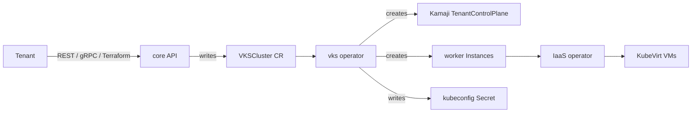

# Kubernetes clusters (VKS)

VirtFoundry Kubernetes Service (VKS) gives a tenant a managed Kubernetes cluster, EKS-style. The control plane runs on the platform ([Kamaji](https://kamaji.clastix.io/)); workers are regular VirtFoundry VMs. The tenant gets a kubeconfig.

!!! note "Separate chart"
    VKS ships as its own chart, `virtfoundry-vks`, from the [`virtfoundry/vks`](https://github.com/virtfoundry/vks) repository. Install order: operator, then core, then VKS ([Versioning](../../project/versioning.md)).

## How it works



| Piece | Role |
|-------|------|
| `VKSCluster` | Tenant-facing resource (`virtfoundry.io/v1alpha1`) |
| vks operator | Creates the Kamaji control plane, the worker `Instance`s and the kubeconfig Secret |
| IaaS operator | Turns each worker `Instance` into a KubeVirt VM |
| Kamaji | Hosts the Kubernetes API server and etcd for the tenant cluster |

<figure markdown="span">
  
  <figcaption>Compute → VKS Clusters. Click to zoom.</figcaption>
</figure>

## Create a cluster

```yaml
apiVersion: virtfoundry.io/v1alpha1
kind: VKSCluster
metadata:
  name: demo
  namespace: virtfoundry-tenant-default
spec:
  kubernetesVersion: v1.36.5   # must match a published node image
  workers:
    count: 1
    templateRef: { name: ubuntu-node-1-36-5 }
    offeringRef: { name: medium }
    networkRef:  { name: default }
```

```bash
kubectl apply -f vkscluster.yaml
kubectl get vksc -A
```

The Kubernetes version must match the node image template (`ubuntu-node-1-36-5` pairs with `v1.36.5`).

## Node image

The worker image is not embedded in the platform. Core seeds a VM template (`ubuntu-node-1-36-5`) at startup. It points to a digest-pinned containerDisk, `ghcr.io/virtfoundry/node-ubuntu`, built by [vks-image-factory](https://github.com/virtfoundry/vks-image-factory) (Ubuntu LTS, containerd, kubelet and kubeadm). KubeVirt pulls it on first use, so nodes need access to `ghcr.io`, or a mirror that your container-image allowlist covers.

## Control plane address

| `spec.controlPlane` | Default | Description |
|---------------------|---------|-------------|
| `serviceType` | `LoadBalancer` | `LoadBalancer`, `NodePort` or `ClusterIP` |
| `port` | `443` | API server port |
| `addressPool` | unset | Pin a MetalLB pool for this cluster. Overrides the controller `--load-balancer-address-pool` flag |
| `address` | unset | Advertised address (used with `NodePort`) |

With the defaults, the VIP comes from the cluster load balancer (MetalLB autoAssign) and no pool is pinned. Pin a pool only when you need a specific range. `NodePort` is a lab escape hatch.

## Kubeconfig and API

- Permissions: `vks:read`, `vks:write`, `vks:kubeconfig`.
- API: gRPC `virtfoundry.vks.v1alpha1.ClusterService` on the same port as REST. REST `/api/v1/vks/clusters` is a thin shim for the console.
- Terraform: [`virtfoundry_vks_cluster`](../terraform.md#vks-clusters) and `virtfoundry_vks_kubeconfig`.

!!! warning "Kubeconfig is a credential"
    The admin kubeconfig grants full access to the tenant cluster. Treat it like a password.

## Limits (current)

No in-place update: changing a cluster argument replaces it. Not included yet: Kubernetes upgrades, add-ons (load balancer, CSI) and multi-zone.
