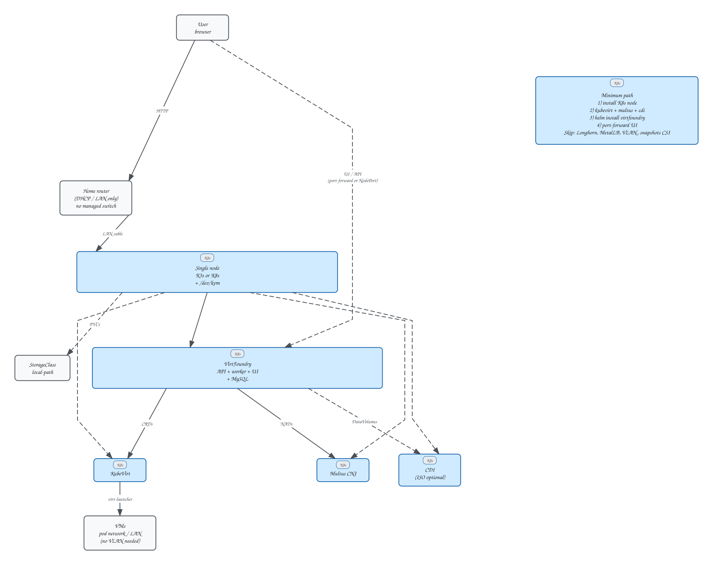
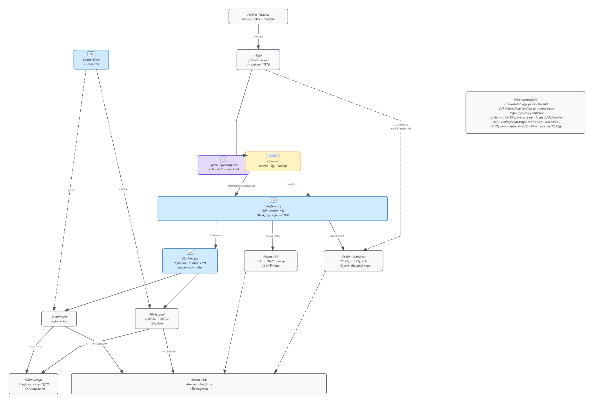

# Deployment topologies

Two reference layouts. Open the `.excalidraw` sources under [`diagrams/`](../diagrams/virtfoundry-minimum-setup.excalidraw) to edit; SVGs below render in the docs site.

## Minimum (home / lab)

Single node, home router only (no managed switch), `local-path`, port-forward to the UI.

| Capability | Works? | Notes |
|------------|--------|-------|
| Install VirtFoundry + deploy VMs | Yes | Needs KubeVirt + Multus (+ CDI for ISO) |
| VPC / private subnet | Yes | Isolated host bridge (`virtfoundry-br0`) on that node |
| Public / shared routable IPs | Only if configured | Default VLAN-style public needs underlay VLAN; home LAN needs bridge/macvlan on the node NIC + IP pool on the router subnet |
| Volume snapshots | No with `local-path` | Use **VM snapshots**; CSI (e.g. Longhorn) later |
| Survive node loss | No | Disks are local |

## Production recommended

Multi-worker, **Longhorn** (preferred) or other replicated block storage, Ingress/Gateway + LB, tenant VPC + public/shared network, CSI volume snapshots and optional observability.

Set `platform.storage.defaultClass=longhorn` and make Longhorn the cluster default StorageClass.

| Capability | Works? | Notes |
|------------|--------|-------|
| VPC / private subnet | Yes | Multus isolated; multi-node same-VPC L2 may need OVN/overlay later |
| Public network | Yes | VLAN underlay **or** LAN/macvlan mode when there is no managed switch |
| Volume snapshots | Yes | Longhorn + CSI snapshotter + `VolumeSnapshotClass` |
| HA / capacity | Yes | Extra workers; CP HA when SLA requires it |

See also: [Installation](installation.md), [Configuration — Snapshots](configuration.md#snapshots-vm-vs-volume).
