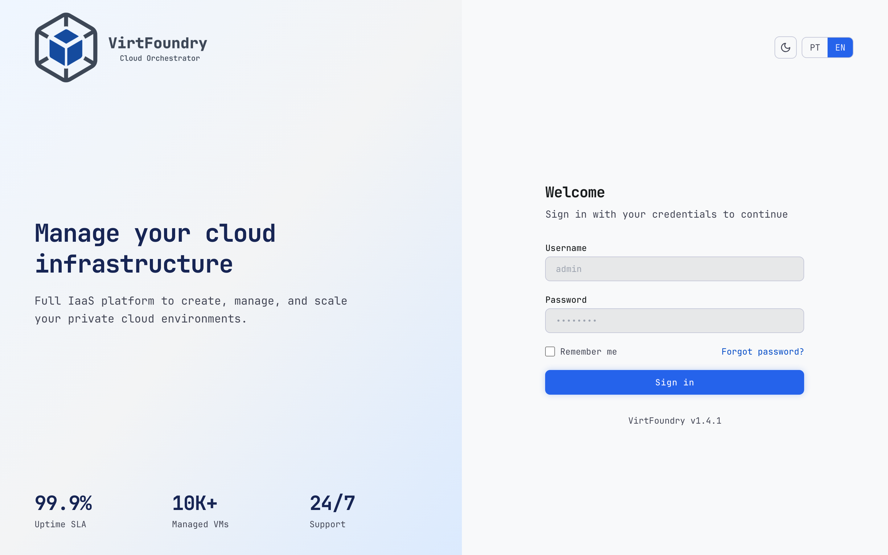
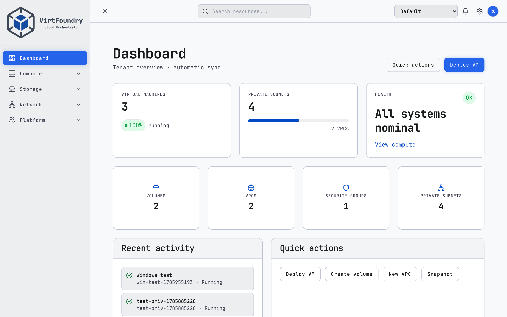
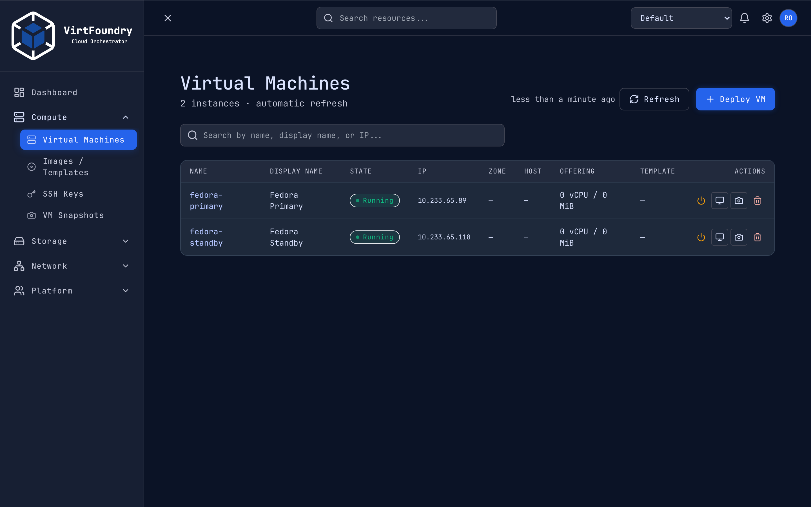
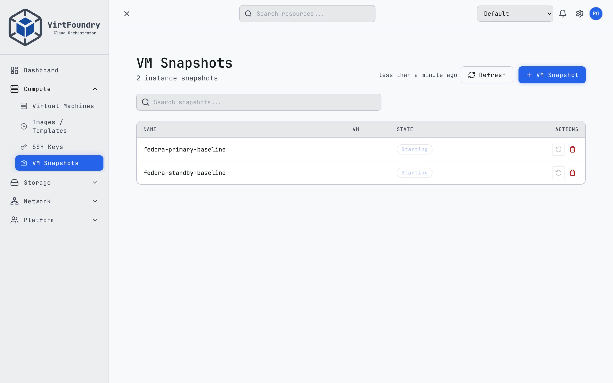
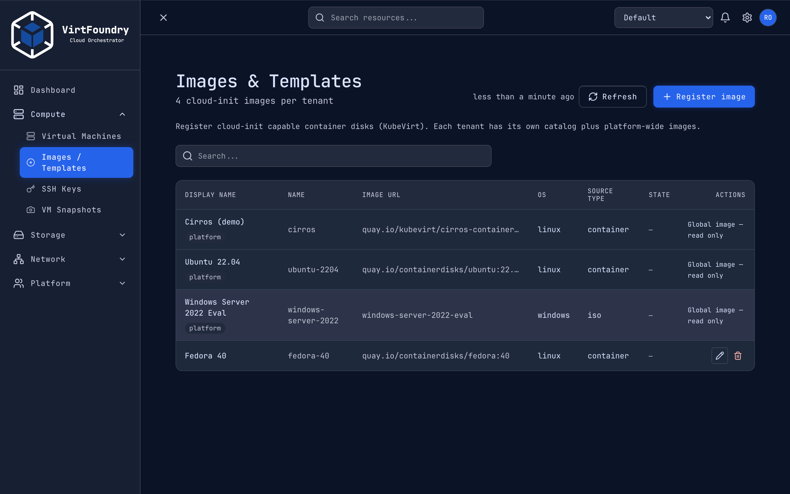
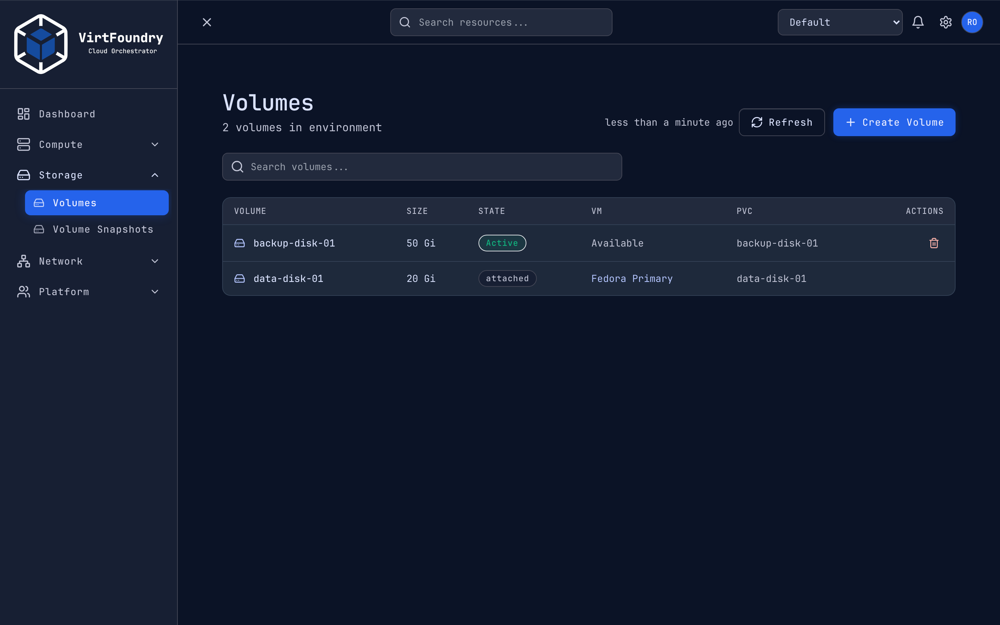
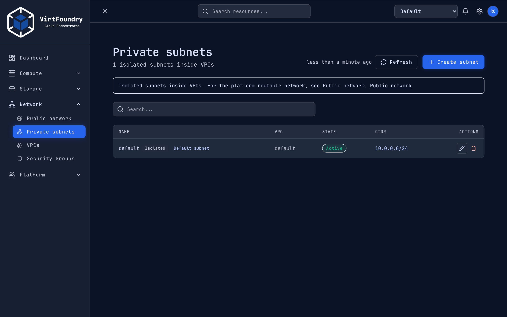
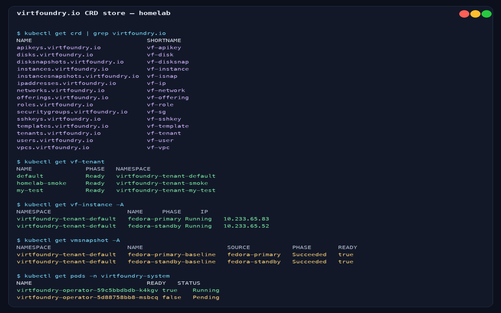

---
hide:
  - navigation
  - toc
title: Home
---

<div class="vf-hero" markdown="1">

<span class="vf-badge">Release v0.5.0</span>

# VirtFoundry

<p class="vf-lead">
Kubernetes-native private cloud control plane — multi-tenant VMs on KubeVirt,
networking with Multus, and a CloudStack-like API/UI. Built for people leaving
Proxmox (or avoiding raw KubeVirt YAML) who already run Kubernetes.
</p>

[Quickstart :material-rocket-launch:](guide/quickstart.md){ .md-button .md-button--primary }
[Kind (laptop) :material-laptop:](guide/kind.md){ .md-button }
[Features :material-view-grid:](guide/features/index.md){ .md-button }
[Why VirtFoundry :material-compass:](guide/why.md){ .md-button }
[Installation :material-download:](guide/installation.md){ .md-button }
[GitHub :material-github:](https://github.com/virtfoundry/core){ .md-button }

</div>

<div class="vf-grid" markdown="1">

<div class="vf-card" markdown="1">

<span class="vf-icon">:material-server:</span>

### Control plane
Go API over **`virtfoundry.io` CRDs** (via [operator](https://github.com/virtfoundry/operator)); REST `/api/v1` for UI, Terraform, and GitOps.

</div>

<div class="vf-card" markdown="1">

<span class="vf-icon">:material-monitor:</span>

### KubeVirt VMs
Deploy, start, stop, snapshot, and console into VirtualMachines from the UI or API.

</div>

<div class="vf-card" markdown="1">

<span class="vf-icon">:material-lan:</span>

### Multus networking
VPCs, isolated L2 networks, public IP pools, and default VPC per tenant.

</div>

<div class="vf-card" markdown="1">

<span class="vf-icon">:material-shield-lock:</span>

### IAM & isolation
JWT login, API keys, roles, tenant namespaces, and Kubernetes NetworkPolicy.

</div>

</div>

## UI

<div class="vf-carousel" data-vf-carousel tabindex="0" aria-roledescription="carousel" aria-label="VirtFoundry UI screenshots">
  <div class="vf-carousel__viewport">
    <div class="vf-carousel__slide is-active" data-caption="Sign-in">
      
    </div>
    <div class="vf-carousel__slide" data-caption="Dashboard — tenant overview and quick actions" aria-hidden="true">
      
    </div>
    <div class="vf-carousel__slide" data-caption="Virtual Machines — lifecycle, console, Running state" aria-hidden="true">
      
    </div>
    <div class="vf-carousel__slide" data-caption="VM Snapshots — KubeVirt point-in-time backups" aria-hidden="true">
      
    </div>
    <div class="vf-carousel__slide" data-caption="Images &amp; Templates — container disks and ISO catalog" aria-hidden="true">
      
    </div>
    <div class="vf-carousel__slide" data-caption="Volumes — attachable disks per tenant" aria-hidden="true">
      
    </div>
    <div class="vf-carousel__slide" data-caption="Networks — VPCs and private subnets" aria-hidden="true">
      
    </div>
    <div class="vf-carousel__slide" data-caption="CRD store — virtfoundry.io tenants, instances, operator" aria-hidden="true">
      
    </div>
  </div>

  <div class="vf-carousel__controls">
    <button type="button" class="vf-carousel__prev" aria-label="Previous screenshot">‹</button>
    <p class="vf-carousel__caption">Sign-in</p>
    <button type="button" class="vf-carousel__next" aria-label="Next screenshot">›</button>
  </div>

  <div class="vf-carousel__dots" role="tablist" aria-label="Screenshot slides">
    <button type="button" class="vf-carousel__dot is-active" role="tab" aria-selected="true" aria-label="Sign-in"></button>
    <button type="button" class="vf-carousel__dot" role="tab" aria-selected="false" aria-label="Dashboard"></button>
    <button type="button" class="vf-carousel__dot" role="tab" aria-selected="false" aria-label="Virtual Machines"></button>
    <button type="button" class="vf-carousel__dot" role="tab" aria-selected="false" aria-label="VM Snapshots"></button>
    <button type="button" class="vf-carousel__dot" role="tab" aria-selected="false" aria-label="Images and Templates"></button>
    <button type="button" class="vf-carousel__dot" role="tab" aria-selected="false" aria-label="Volumes"></button>
    <button type="button" class="vf-carousel__dot" role="tab" aria-selected="false" aria-label="Networks"></button>
    <button type="button" class="vf-carousel__dot" role="tab" aria-selected="false" aria-label="CRD store"></button>
  </div>
</div>

## Quick install

```bash
helm repo add virtfoundry https://virtfoundry.github.io/helm-charts
helm repo update

# 1. CRDs + operator
helm install virtfoundry-operator virtfoundry/virtfoundry-operator \
  --namespace virtfoundry-system --create-namespace

# 2. API + UI
helm install virtfoundry virtfoundry/virtfoundry \
  --version 0.5.0 \
  --namespace virtfoundry-system \
  --set secrets.rootPassword='your-root-password' \
  --set secrets.jwtSecret='your-jwt-secret'
```

Gateway API or Ingress profiles are configured via Helm values — see [Configuration](guide/configuration.md). Laptop lab with no VLAN: [Kind](guide/kind.md).

## Before you install

VirtFoundry requires **KubeVirt**, **Multus**, and **CDI** (for ISO/import paths) on the cluster, plus **`virtfoundry-operator`** for the CRD store. The `virtfoundry` chart deploys API + UI only. See [Installation → Prerequisites](guide/installation.md#why-each-platform-component-is-needed).

## Architecture

| Layer | Technology |
|-------|------------|
| Control plane | Go API + [virtfoundry-operator](https://github.com/virtfoundry/operator) (`virtfoundry.io` CRDs) |
| Persistence | Kubernetes CRDs (+ Secrets for credential hashes) |
| Hypervisor | KubeVirt VirtualMachine |
| Networking | Multus NADs, host bridges, optional MetalLB |
| Security | IAM, JWT, API keys, tenant namespaces, NetworkPolicy |
| UI | React + Vite + Redux + TanStack Query |
| Packaging | Helm chart (`helm-charts`) |

## Repositories

| Repository | Role |
|------------|------|
| [core](https://github.com/virtfoundry/core) | Application source (API, UI, kubernetes store) |
| [operator](https://github.com/virtfoundry/operator) | CRDs and Kubernetes operator |
| [helm-charts](https://github.com/virtfoundry/helm-charts) | Helm charts, deploy scripts, this documentation |

<div class="vf-links" markdown="1">

[Quickstart](guide/quickstart.md)
[Kind (laptop)](guide/kind.md)
[Why VirtFoundry](guide/why.md)
[Installation guide](guide/installation.md)
[Website / front door](project/website.md)
[Helm repository](guide/helm-repository.md)
[Versioning policy](project/versioning.md)
[Contributing](https://github.com/virtfoundry/helm-charts/blob/main/CONTRIBUTING.md)
[GitHub Issues](https://github.com/virtfoundry/core/issues)

</div>

## Support

- [Governance](project/governance.md)
- [Sponsorship](project/sponsorship.md)
